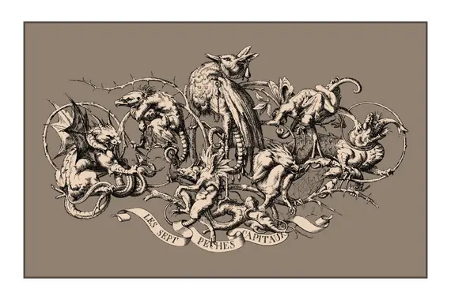

</img>
# seven deadly sins in gemma-2-2b

exploring emotion vectors based on inspiration from anthropic's paper, with a twist.

original paper from anthropic is [here](https://transformer-circuits.pub/2026/emotions/index.html)

blog post: 

video: [coming soon](README.md)


steps to reproduce (the repository and the results):

1. make sure the data is in the appropriate form. the one i used to do this project are provided as a baseline, you may experiment with other stories. use `data-prep/parse_stories.py` if you are using my format of stories (one .txt file per sin, each story separated by a newline)


2. the actual emotion vector extraction path. refer to the anthropic video for more details on how it is actually done (the math and the intuition)

in the root directory of this project run:

```
uv run python sinful-vector-generation-raw.py
uv run python sinful-vector-clean.py
streamlit run sinclopedia.py
```

3. go the streamlit url and use the explorer to perform studies.